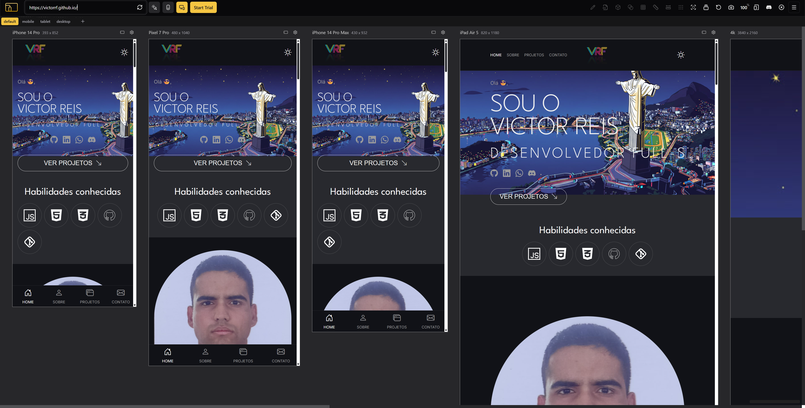
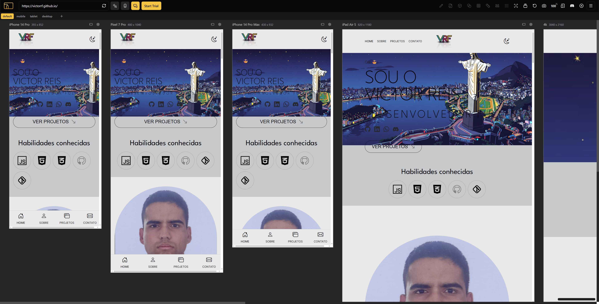
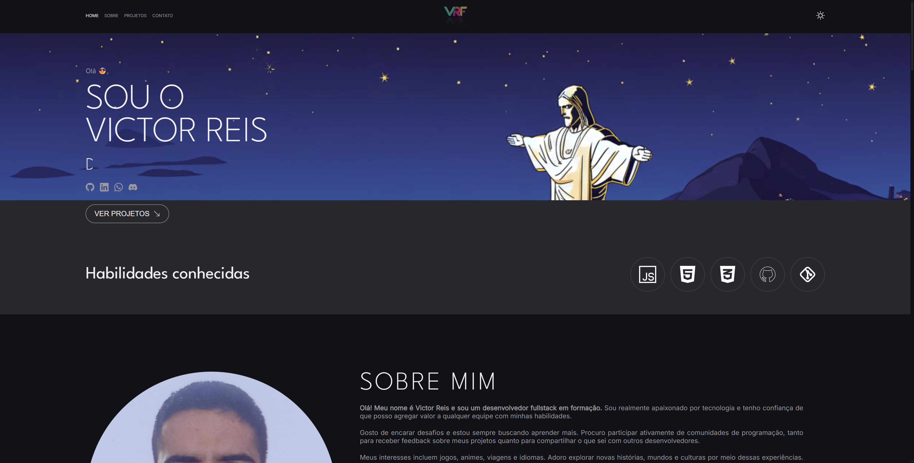
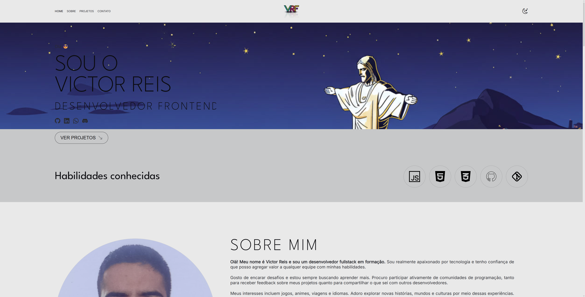

# 🖥️ Portfólio – Victor Reis
## 💡 Foco na funcionalidade e interatividade
Este projeto foi desenvolvido utilizando HTML, CSS e JavaScript.

- Estrutura com HTML: Responsável pela construção semântica da página, garantindo organização e acessibilidade.

- Estilização com CSS: Aplicação de um design responsivo, moderno e adaptado para diferentes resoluções.

- Interatividade com JavaScript: Utilizado principalmente para implementar a funcionalidade de alternância entre os temas Dark e Light, proporcionando uma experiência mais fluida, moderna e personalizável para o usuário.

## 📱💻 Versões do Projeto
### Versões para **Mobile** e **Tablet**
#### ⚫ Dark Theme

#### ⚪ Light Theme

### Versão para **Desktop**
#### ⚫ Dark Theme

#### ⚪ Light Theme

## ✍️ Aprendizados

Este portfólio representou uma grande oportunidade de evolução pessoal e técnica. Desafios surgiram a cada nova funcionalidade ou estilização — e cada um deles trouxe aprendizados valiosos sobre HTML, CSS e JavaScript.

Busquei absorver ao máximo cada etapa para construir uma página interativa, organizada e visualmente agradável.

## 📝 Observações Importantes

As imagens utilizadas no projeto foram criadas com Inteligência Artificial.
Utilizei meus conhecimentos em prompt engineering para gerar as ilustrações na plataforma  [Leonardo AI](https://leonardo.ai/)

## 🧙‍♂️ A Importância da [DIO](https://www.dio.me/) no Meu Processo

A [DIO](https://www.dio.me/) foi essencial para que este projeto ganhasse vida. Todo o conhecimento aplicado — desde fundamentos até práticas modernas de desenvolvimento web — vem do aprendizado contínuo que venho adquirindo dentro da plataforma.

Sigo em constante evolução para me tornar um desenvolvedor web completo.

## 🔗 Acesse o Projeto

👉 https://victorrf.github.io/

## 📞 Contato

- 📧 E-mail: victorreisferreira1998@gmail.com

- 🔗 LinkedIn: https://www.linkedin.com/in/victorreisferreira/